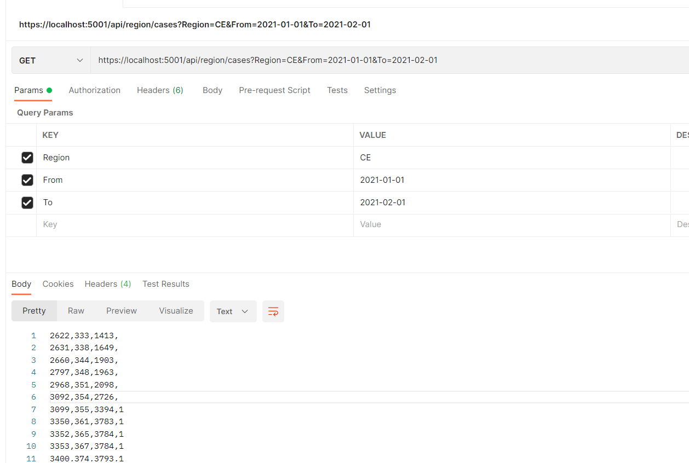

# WebAPI-assignment
WebAPI assignment for an internship at IndigoLabs

Service runs directly off the URL without the additional need to download the data on a personal HD, using a Streamreader.

* api/region/cases:

It supports **optional** query parameters such as Region, To and From. Upon the GET request it exposes 4 types of data parameters: Active, Deceased, Vaccinated 1st, Vaccinated 2nd cases. Resultset is written in default CSV format without the header. 

* api/region/lastweek:

It exposes the sum of number of active cases in the past 7 days for each available region, including foreign and unknown. The data set is available in descending order, ordered by the latter sum. Resultset is written in: "Regija: %s, Vsota: %d" format.

Postman's POV:

